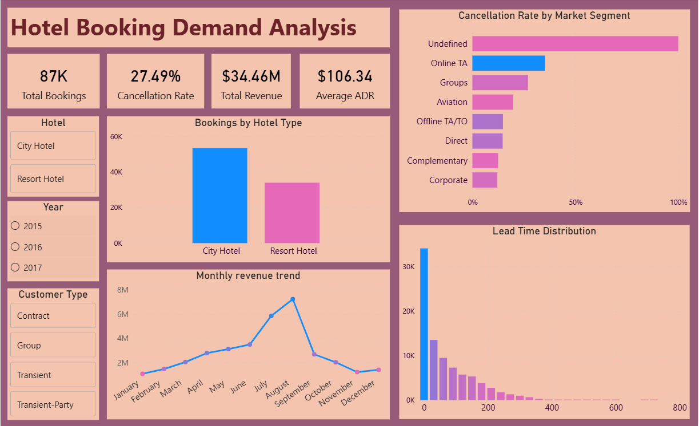

# Hotel Booking Demand Analysis

## Project Overview
This project analyzes hotel booking demand data to identify booking patterns, cancellation behavior, lead time distribution, and seasonal trends.
Python is used for data cleaning, exploratory data analysis, and feature engineering, while Power BI is used to build an interactive dashboard for business reporting.

The objective of this project is to generate actionable insights that help hotels optimize booking strategies, manage cancellations, and improve revenue planning.

---

## Tools & Technologies Used
- **Python (Pandas, Matplotlib, Seaborn)**
- **Jupyter Notebook**
- **Power BI**
- **Git & GitHub**

---

## Dataset
- Hotel Booking Demand dataset (CSV format)

---

## Project Workflow
1. Data loading and inspection
2. Data cleaning and preprocessing
3. Exploratory Data Analysis (EDA)
4. Data visualization using Python
5. Interactive dashboard creation using Power BI
6. Insight generation and business recommendations

---

## Key Insights
- City Hotels have more bookings than Resort Hotels, showing higher demand for city stays.

- Cancellation rate is high (27.49%), which can significantly affect hotel revenue.

- Online Travel Agent bookings have the highest cancellations, while Corporate bookings are more reliable.

- Most customers book with short lead time, but longer lead-time bookings cancel more often.

- Revenue peaks in mid-year (around July–August), showing strong seasonal demand

---

## Power BI Dashboard
The Power BI dashboard provides an interactive view of hotel booking demand and includes:
- KPI cards (Total Bookings, Cancellation Rate, Total Revenue, Average ADR)
- Bookings by hotel type
- Cancellation rate by market segment
- Monthly revenue trends
- Lead time distribution
- Interactive slicers for Hotel Type, Year, and Customer Type

**Power BI File:**  
- [Download Power BI Dashboard](powerbi/hotel_booking_dashboard.pbix)

### 📊 Power BI Dashboard Screenshot



## Python Visualizations
Some key visualizations created using Python include:
- **Monthly Bookings** – Bar chart showing the total number of bookings per month.
- **Lead Time Distribution** – Displays booking distribution based on how many days in advance reservations are made.
- **Bookings by Market Segment** – Count plot showing the number of bookings for each market segment.

---

## Project Structure
```
Hotel-Booking-Demand-Analysis/
│
├── data/
│   ├── hotel_bookings.csv
│   └── hotel_bookings_cleaned.csv
│
├── notebooks/
│   └── hotel_booking_analysis.ipynb
│
├── powerbi/
│   └── hotel_booking_dashboard.pbix
│
├── screenshots/
│   ├── hotel_booking_dashboard_overview.png
│   ├── python_visual_1.png                   # Monthly Bookings chart
│   ├── python_visual_2.png                   # Bookings by Market Segment chart
│   └── python_visual_3.png                   #Lead Time Distribution Chart
│
└── README.md
```
